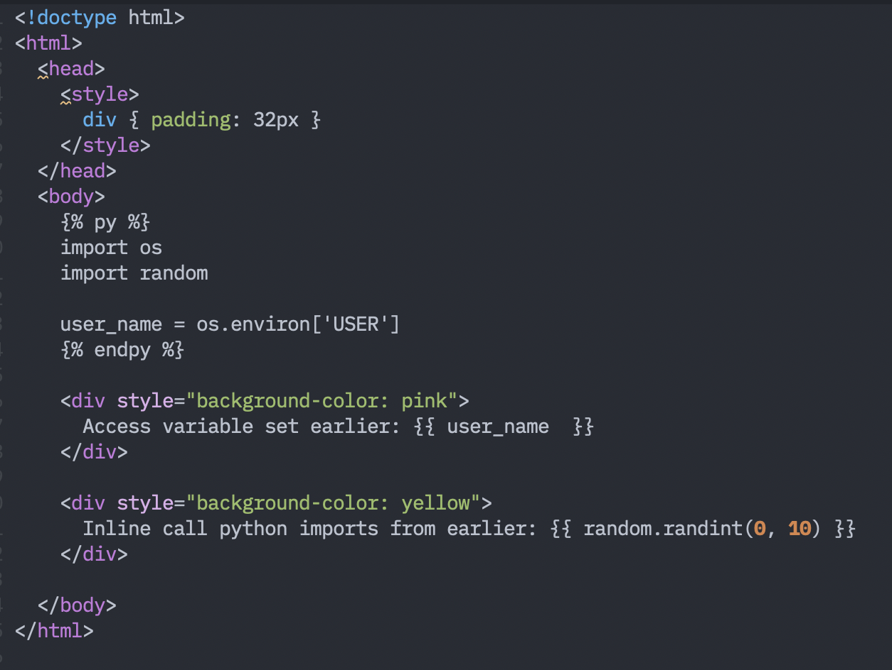

# (Py)HP (H)ypertext (P)reprocessor

I want PHP style 'quick' template execution, but with Python instead.



**Warning**: Currently *very* insecure. Do not use.


## Credit

I stole a lot of code [from stackoverflow](https://stackoverflow.com/a/55545295). Thanks
to [@aarondewindt](https://github.com/aarondewindt) for helping make this a reality.

## Installation

PyHP is installable with `pip`.


``` bash
pip install pyhp-hypertext-preprocessor
```

You can then serve `.pyhp` files fom your current directory with:

``` bash
pyhp
```

It is accessible at `http://localhost:5000`. If you have an `index.pyhp` file,
that will be served. If not, you'll have to explicitly go to `http://localhost:5000/myfile.pyhp`
to execute `myfile.pyhp`. Static files with common extensions (like css, js, jpg, etc)
will automatically be served as static files.

## Production install

We suggest using [gunicorn](https://gunicorn.org/) to deploy to production.
`gunicorn pyhp` should start serving files from the current working directory
of `gunicorn`.

## Setup

You can set it up for local development with:

1. Fork this repository & clone your fork to your local machine.
2. Setup a virtual environment in your clone:

   ```bash
   python3 -m venv venv
   source venv/bin/activate
   ```

3. Install the `pyhp` package

   ```bash
   pip install -e .
   ```

4. Run `pyhp`!

   ```bash
   python3 -m pyhp.app
   ```

   This should serve the contents of the current directory. You can
   try going to `http://localhost:5000/hi.pyhp` to test it out.
